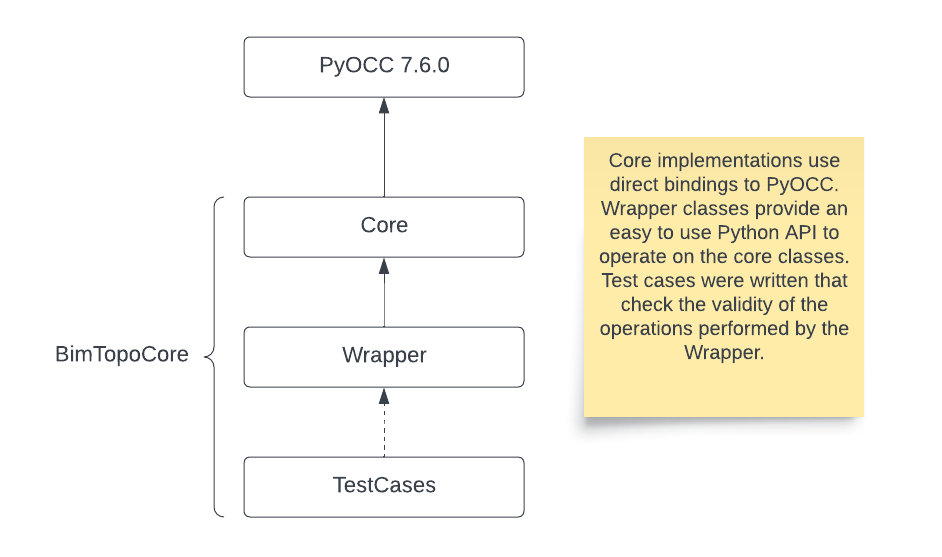
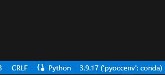
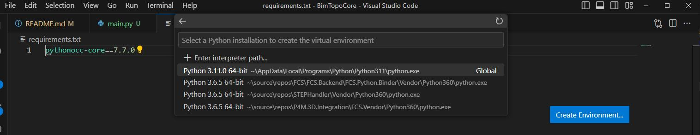
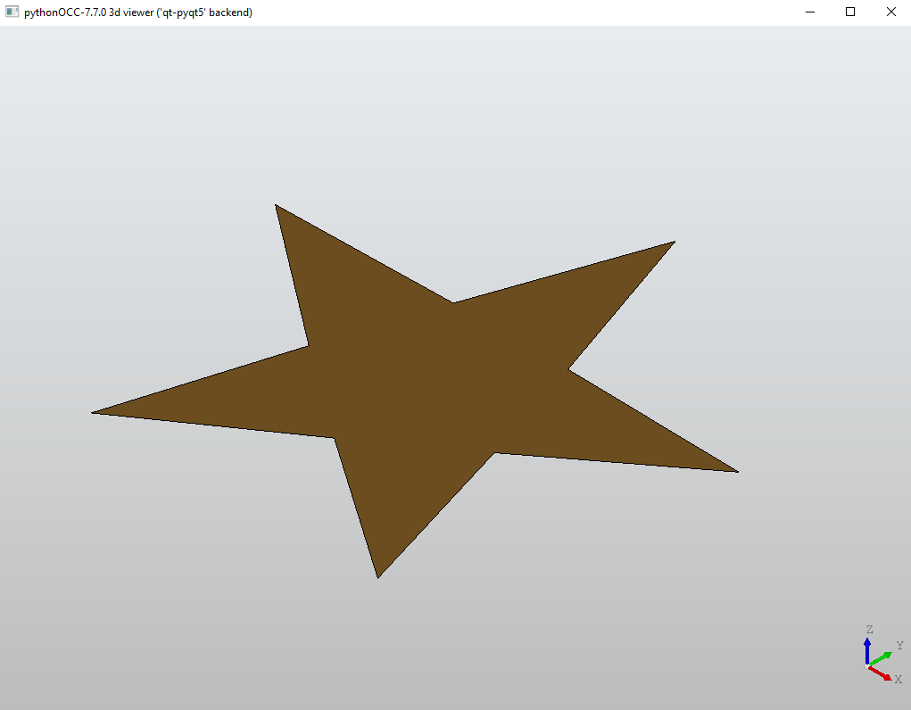

# BimTopoCore
Conceptual design library for BIM (building information management) built using Python bindings to OpenCascade libraries.

## Software Architecture and Overview
There are three components of this library. The 'Core' component contains classes and methods that directly reference the bindings provided by PyOCC. The 'Wrapper' classes provide static methods to operate on the 'Core' entities. 

Note, the naming convention adopted here is the following:
```python
# For all core objects we prepend the word 'core' for clarity. 
from Core.Topology import Topology as coreTopology 
# for Wrapper classes that operate on core entities do not add pseudonyms
from Wrapper.Topology import Topology
```

## Getting Started
Currently this setup encourages the usage of Conda because it will create the environment with the correct Python version installed. The following commands are required, if the specific environment has not yet been created.
```
conda create --name=pyoccenv python=3.9
conda activate pyoccenv
conda install -c conda-forge pythonocc-core=7.7.0 PyQt5
```
Note, if for any reason the PyQt5 package does not install on your machine you should try it to install it manually (inside the pyoccenv, of course) with `pip install PyQt5`. The PyQt5If we have the environment prepared it should be sufficient to just run main.py as follows:
```
python main.py
```
Conveniently, using VSCode in the bottom right corner we can select this environment and just hit the 'Run and Debug' button. When activated, it will explicitly say 'pyoccenv' with conda (see figure below).


Alternatively, we could use local python installation that must be of version 3.9 to function correctly with the PyOCC libraries. Assuming we have python3.9 installed we could create the environment more neatly as follows (Windows):
```
python3.9 -m venv env
.\env\Scripts\activate
pip install -r requirements.txt
```
On Unix or MacOS, run:
```
source env/bin/activate
```
instead of `.\env\Scripts\activate`. This solution is preferred and is the one that will run in the pipeline/deployments. Furthermore, VS Code has another nice feature to create this environment using the UI:


## Visualization of Results
For basic visualization of results the PyQt5 package is a necessary pre-requisite. Bear in mind this package is owned by Riverbanks Computing Ltd. and does require a license if used commercially. Thus the usage of this package should be limited to aiding local development.
